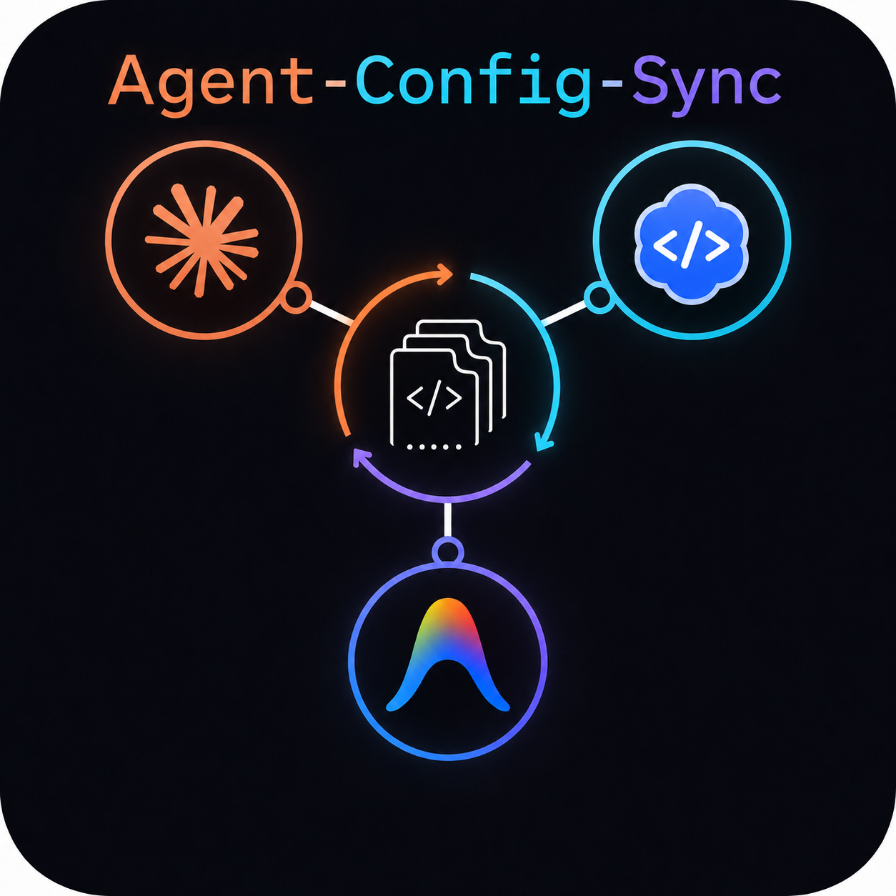

<p align="center">
  
</p>

# agent-config-sync

> This is the sanitized PUBLIC MIRROR of a private deployment, published
> for the Kaggle AI Agents Intensive capstone (Freestyle track). Personal
> standards and the operator's full 36-skill library are replaced with
> compact examples; all code, tests, security gates, threat models, and
> lessons are the real thing. Capstone writeup:
> [docs/KAGGLE_WRITEUP.md](docs/KAGGLE_WRITEUP.md).

> One source of truth for the AI coding assistants you run side-by-side.
> Write a standard or skill once, project it to Claude Code, Codex, and
> Gemini/AntiGravity, and promote useful runtime edits back into the source.

Status: v1 feature-complete, with operational hardening for backup retention,
repo-scoped locking, hook validation, hermetic CLI E2E coverage, and pinned build
and CI supply-chain inputs. The current local baseline is **217 passing tests**
(the count grows as features land; `docs/EVALUATION.md` is the running log).
See [docs/LIMITATIONS.md](docs/LIMITATIONS.md) for accepted boundaries.

## Intended audience

Built for a single operator running Claude Code, Codex, and Gemini/AntiGravity
side-by-side who wants one reviewed source of truth for standards and skills.
Expected background: comfortable running CLI commands and reading Markdown
diffs; no Python knowledge is needed to operate it.

## Start here

This repository owns the source files. Runtime instruction files and managed
skills are generated from this repo. Do not hand-edit generated files unless you
intend to run `promote` afterward.

| You want to | Command |
|---|---|
| See whether runtimes are in sync | `agent-config-sync check` |
| See what changed and how to resolve it | `agent-config-sync sense` |
| Check a candidate skill for redundancy | `agent-config-sync overlap <name> --from <runtime>` |
| Serve sync state to MCP clients (read-only) | `agent-config-sync mcp-serve` |
| Show per-runtime status | `agent-config-sync status` |
| Push source to runtimes | `agent-config-sync project` |
| Capture a reviewed rule or skill | `agent-config-sync capture ...` |
| Promote a runtime edit back to source | `agent-config-sync promote <runtime>` |
| Install startup drift hooks | `agent-config-sync install-hooks` |
| Preview old backup cleanup | `agent-config-sync prune-backups` |

## Mental model

```text
_shared/core.md + overlays/<runtime>.md + skills/<name>/SKILL.md
        |
        | project / project_skills
        v
~/.claude, ~/.codex, ~/.gemini instruction files and skills
        ^
        | promote / capture --confirm
        |
reviewed runtime edits or chat-provided rules/skills
```

That is the core write loop. Sensing, the ambient watcher, the MCP server,
and the operator-invoked proposal agent all sit on top of it, read-only until
an operator approves a step back into this loop; see the full diagram in
[docs/ARCHITECTURE.md](docs/ARCHITECTURE.md).

## Repo layout

```text
_shared/core.md          neutral standards source
config/targets.yaml      managed runtime targets and skills
docs/                    architecture, usage, evaluation, limitations, threat models
hooks/                   local helper hooks
Lessons/                 educational walkthroughs
overlays/                runtime-specific instruction additions
references/              runtime adapter references
skills/<name>/SKILL.md   managed skill bodies
src/agent_config_sync/   Python CLI implementation
tests/                   regression and safety tests
```

## Quickstart

```bash
git clone https://github.com/mwill20/agent-config-sync-public.git
cd agent-config-sync-public
python -m venv .venv
.venv\Scripts\Activate.ps1        # Windows; source .venv/bin/activate elsewhere
python -m pip install -e ".[dev]"
agent-config-sync check           # exit 0 = everything in sync
agent-config-sync project --dry-run   # preview writes; nothing is modified
```

Expected result: `check` prints `All runtimes in sync.` and exits 0; the
dry-run lists each would-be write as `create`/`update`/`unchanged` without
touching any file. Validate with:

```bash
PYTEST_DISABLE_PLUGIN_AUTOLOAD=1 python -m pytest -q
```

## Install

```bash
python -m pip install -e ".[dev]"
python -m agent_config_sync project
```

The build backend is pinned to `setuptools==81.0.0`; declared runtime and development
dependencies are also exact-version pinned in `pyproject.toml`. The installed
console script is `agent-config-sync`. `python -m agent_config_sync` also works
when the script is not on `PATH`.

## Everyday commands

```bash
agent-config-sync status
agent-config-sync check
agent-config-sync doctor
agent-config-sync project
agent-config-sync project claude
agent-config-sync project claude --force
```

`project` refuses to overwrite out-of-band runtime edits. Use `promote` first, or
use a scoped `--force` when you intentionally want to discard a runtime edit.

## Skills

```bash
agent-config-sync enroll my-skill
agent-config-sync enroll my-skill --from claude
agent-config-sync enroll my-skill --body-file ./body.md
agent-config-sync project
```

Skill names use a portable lowercase/hyphen grammar. Path-like names, spaces,
dots, underscores, and Windows reserved device names are rejected.

Only skills listed under `managed_skills` in `config/targets.yaml` are
canonical; this mirror ships two example managed skills (the private deployment manages 36), enrolled one at a time
from the user-global Claude skills directory (`~/.claude/skills`). Project-local
and plugin-provided skills are out of scope and are never enrolled. Enrollment
from Claude is intentionally one skill at a time:

```bash
agent-config-sync enroll my-skill --from claude
agent-config-sync project
agent-config-sync check
```

The projector copies the canonical `SKILL.md`, the selected runtime adapter
under `references/`, and reviewed **text** companion files placed under
`skills/<name>/` in this repository (`.md .txt .json .yaml .yml .toml`).
Companions pass the same neutral-language and secret gates as bodies at
projection time. Scripts, virtual environments, browser profiles, and caches
are refused. Review and neutralize a runtime-local skill before enrollment;
never bulk-copy `~/.claude/skills` into this repository. See
[Usage](docs/USAGE.md) and [Limitations](docs/LIMITATIONS.md).

## Capture and promote

```bash
agent-config-sync capture standard --target core --text-file ./rule.md
agent-config-sync capture standard --target core --text-file ./rule.md --confirm
agent-config-sync capture skill --name my-skill --body-file ./body.md --confirm

agent-config-sync promote
agent-config-sync promote gemini --target core
agent-config-sync promote gemini --target core --confirm
```

`capture` and `promote` are dry-run by default unless `--confirm` is used.
Promote is exact, not a general merge engine: append edits are supported;
delete/replace edits must map uniquely to the selected source target.

## Startup hooks

```bash
agent-config-sync install-hooks --dry-run
agent-config-sync install-hooks
```

The command installs `agent-config-sync sense` as a startup hook (replacing a
previously installed `check` hook). At session start it names what changed,
whether the source or a runtime copy is ahead, the exact resolution command,
and any unmanaged skills that are enrollment candidates; the AI reading the
output is instructed to ask the operator before acting. Claude and Codex are
direct merge-safe config writes. Gemini remains delegated to
`gemini hooks migrate --from-claude`.

```bash
agent-config-sync sense          # human/AI-facing findings, exit 1 if any
agent-config-sync sense --json   # machine-readable, for watchers/automation
```

Deliberate non-candidates (e.g. a skill that cannot be enrolled yet) are
recorded under `sense_ignore_skills` in `config/targets.yaml` so they are not
re-flagged every session.

## Ambient watcher

A daily scheduled task runs one read-only watcher cycle between AI sessions:

```bash
agent-config-sync watch-once   # one cycle: sense + pending.json + notification text
```

The wrapper `scripts/sense-watcher.ps1` shows the result as a Windows balloon.
Findings are persisted to `%LOCALAPPDATA%/agent-config-sync/pending.json`
(advisory-only; the session-start hook always re-runs `sense` live). The daily
clean-run notification doubles as the watcher heartbeat: one signal per day,
findings or "alive" — silence means the watcher itself is broken. Register and
remove with the `schtasks` lines documented in the wrapper script; the watcher
never runs a mutating command.

## Backup maintenance

Backups are stored under `.backups/` and are ignored by git because they may hold
real runtime config. Backup names are collision-safe. Cleanup is explicit:

```bash
agent-config-sync prune-backups
agent-config-sync prune-backups --confirm
```

Dry-run is the default. Confirmed pruning keeps at least the newest 10 snapshots
per backup category and preserves anything newer than 30 days. Confirmed pruning
is audit-logged.

## Operational safety

- Projection writes are allowlisted through `config/targets.yaml`.
- Drift refusal covers instruction files and managed skills; a blanket `--force`
  that would overwrite more than one drifted target (instructions and skills
  counted together) is refused; scope it to one runtime.
- `promote` reprojects with a runtime-scoped force, so another runtime's own
  un-promoted edit is refused, not clobbered, during fan-out.
- Source/runtime/settings overwrites are backed up before mutation.
- Consequential writes are recorded in `.sync-audit.log`.
- Mutating commands use a repo-scoped `.sync-state.lock/` lock.
- Stale-looking locks fail closed and require operator inspection.
- Hook writers validate malformed-but-parseable config shapes before mutation.
- The Python build backend is exact-version pinned, and GitHub Actions are
  referenced by immutable commit SHA to reduce dependency drift.
- CI runs the full test suite across Windows, Linux, and macOS plus a hermetic
  Gemini CLI E2E subprocess test.

## Exit codes

| Code | Meaning |
|---:|---|
| 0 | Success |
| 1 | `check` found drift |
| 2 | Operator/action issue such as drift refusal, unknown runtime, promote conflict, or missing baseline |
| 3 | Config, secret, non-neutral body, hook, projection, or pruning failure |
| 4 | Unsafe blanket force request |
| 5 | Repo mutation lock is already held |

## Examples

`examples/sample_rule.md` is a neutral standard you can feed to the capture
workflow; `examples/sample_output.txt` shows what healthy `check`, dry-run,
and capture output looks like:

```bash
agent-config-sync capture standard --target core --text-file examples/sample_rule.md
```

## Support

Open a GitHub issue for questions, bugs, or feature requests. Report security
issues per [SECURITY.md](SECURITY.md).

## Documentation

- [Repository audit](REPO_AUDIT.md)
- [Changelog](CHANGELOG.md)
- [Contributing](CONTRIBUTING.md)
- [Architecture](docs/ARCHITECTURE.md)
- [Installation](docs/INSTALLATION.md)
- [Usage](docs/USAGE.md)
- [Limitations](docs/LIMITATIONS.md)
- [Tradeoffs](docs/TRADEOFFS.md)
- [Evaluation](docs/EVALUATION.md)
- [Troubleshooting](docs/TROUBLESHOOTING.md)
- [Audit brief](docs/AUDIT_BRIEF.md)
- [Lessons](Lessons/00_Index.md)

## License

MIT. See [LICENSE](LICENSE).